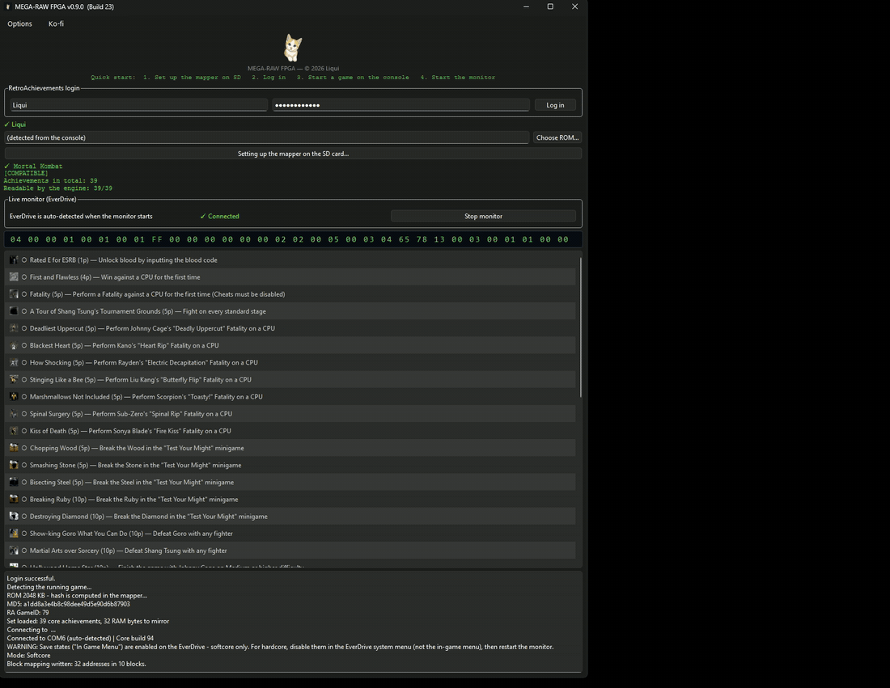
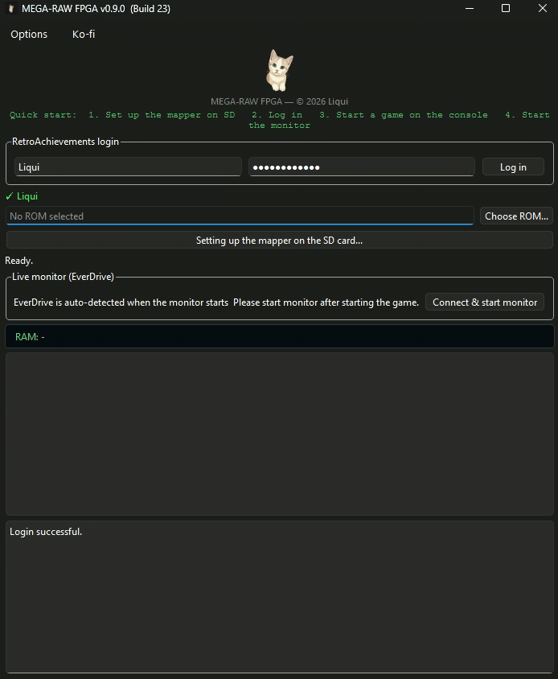

# MEGA-RAW

**RetroAchievements on real Mega Drive hardware — no emulator, no ROM patch.**

MEGA-RAW connects a physical Mega Drive, a Mega EverDrive CORE and
RetroAchievements.
A custom FPGA mapper watches the 68000 bus as the game runs, identifies the
cartridge by itself, and brings its own in-game save state menu along.

**Project page: https://liquid-wq.github.io/mega-raw/**

*An achievement unlocking on real hardware.*

*Log in, and the cartridge in the console identifies itself.*

*Deutsche Fassung weiter unten.*

---

## Two builds

| | FPGA *(recommended)* | Legacy *(patched)* |
|---|---|---|
| ROM stays untouched | yes | no, an IPS patch is applied |
| Game detection | automatic, from the cartridge | manual file selection |
| Hook database needed | no | yes |
| 2 MB size limit | no | yes |
| In-game save state menu | yes, its own | the EverDrive's own |
| Hardcore mode | yes | yes |
| Games prepared | any Mega Drive cartridge | 602 patched titles |

The FPGA build replaces the cartridge mapper with a custom core. Nothing is
patched, nothing is injected, and no per-game hook database has to be maintained.

The legacy build patches a small routine into the ROM that reports values the PC
reads over USB. It still works and stays available, but new work goes into the
FPGA build.

## How it works

Three things happen at the same time, all inside the FPGA:

- **Work RAM mirror** — writes to the console's work RAM are mirrored into the
  mapper's own block RAM as the CPU makes them.
- **Cartridge identification** — the mapper reads the ROM itself in the idle gaps
  between 68000 bus cycles and hashes it. Sixteen bytes travel over USB instead
  of two megabytes, so a game is recognised in seconds.
- **Save state menu** — replacing the cartridge mapper normally costs you the
  EverDrive's in-game menu: the save state controller is not part of the
  published sources, so a custom core has nothing to fall back on. MEGA-RAW
  brings its own along instead. Start + Down opens an overlay over the running
  game. The mapper catches the CPU on the next vertical blank and keeps a
  complete picture of the machine — work RAM, video RAM, colour RAM, VDP
  registers, Z80 and its memory — then puts it all back exactly as it was.

Your PC reads the live RAM mirror over USB and evaluates the achievement
conditions there. Nothing is written back into the running game.

### Known limits

The same limits apply as to any hardware save state: games without vertical blank
interrupts cannot be interrupted, and the sound chips cannot be captured.

Some games use the Start button themselves. If **Continue** does not react in the
menu, confirm with **C** instead.

## Requirements

- Mega EverDrive CORE (Krikzz) — this is what MEGA-RAW is developed and tested on.
  The PRO uses the same interface and should work, but has not been tested.
  Other models are untested.
- Original Mega Drive / Genesis hardware
- USB connection between EverDrive and PC
- Windows
- A free RetroAchievements account

## Setup

1. Download the latest release and unpack it.
2. Start the program and log in with your RetroAchievements account.
3. Use **Set up mapper on SD card** and point it at your SD card. The custom core
   is copied to every location the console loads from.
4. Put the card back into the console and start a game.
5. Press **Connect & start monitor**. The game is detected automatically.

## Hardcore mode

MEGA-RAW checks your setup before and during a session and only counts Hardcore
when the conditions are actually met. If the EverDrive's own in-game menu is
enabled, MEGA-RAW says so and switches to Softcore, so no Hardcore unlock happens
on a configuration that would not qualify.

## License

MEGA-RAW is free to use. The source is public to read and audit, but it is not
open source — see [LICENSE](LICENSE).

Third-party components are listed in
[THIRD-PARTY-NOTICES.txt](THIRD-PARTY-NOTICES.txt).

## Repository layout

| Folder | Contents |
|---|---|
| `cpp_fpga/` | the FPGA build (this is the current one) |
| `legacy/cpp/` | the patched build, C++ port |
| `legacy/python/` | the patched build, original Python version |

## Related

There is a NES counterpart: [RAW-NES](https://github.com/liquid-wq/raw-nes).

Built by [Liqui](https://github.com/liquid-wq).

---

# MEGA-RAW (deutsch)

**RetroAchievements auf echter Mega-Drive-Hardware — kein Emulator, kein
ROM-Patch.**

MEGA-RAW verbindet ein echtes Mega Drive, ein Mega EverDrive CORE und
RetroAchievements. Ein eigener FPGA-Mapper liest den 68000-Bus mit, während das
Spiel läuft, erkennt die Kassette selbst und bringt ein eigenes Ingame-Menü für
Speicherstände mit.

**Projektseite: https://liquid-wq.github.io/mega-raw/**

## Zwei Fassungen

| | FPGA *(empfohlen)* | Klassisch *(gepatcht)* |
|---|---|---|
| ROM bleibt unverändert | ja | nein, es wird ein IPS-Patch angewendet |
| Spielerkennung | automatisch, aus der Kassette | Datei von Hand wählen |
| Hook-Datenbank nötig | nein | ja |
| 2-MB-Grenze | nein | ja |
| Ingame-Menü für Speicherstände | ja, ein eigenes | das des EverDrive |
| Hardcore-Modus | ja | ja |
| Vorbereitete Spiele | jede Mega-Drive-Kassette | 602 gepatchte Titel |

Die FPGA-Fassung ersetzt den Kassetten-Mapper durch einen eigenen Kern. Es wird
nichts gepatcht, nichts eingeschleust, und es muss keine Hook-Datenbank gepflegt
werden.

Die klassische Fassung patcht eine kleine Routine ins ROM, die Werte meldet, die
der PC über USB liest. Sie funktioniert weiterhin und bleibt verfügbar, neue
Arbeit fließt aber in die FPGA-Fassung.

## Wie es funktioniert

Drei Dinge passieren gleichzeitig, alle im FPGA:

- **Work-RAM-Spiegel** — Schreibzugriffe auf das Work-RAM der Konsole werden in
  den Blockspeicher des Mappers gespiegelt, während die CPU sie ausführt.
- **Kassettenerkennung** — der Mapper liest das ROM selbst in den Lücken zwischen
  den 68000-Buszyklen und bildet den Hash. Über USB gehen sechzehn Byte statt
  zwei Megabyte, ein Spiel ist damit in Sekunden erkannt.
- **Speicherstand-Menü** — wer den Kassetten-Mapper ersetzt, verliert damit
  normalerweise das Ingame-Menü des EverDrive: Der Savestate-Controller gehört
  nicht zu den veröffentlichten Quellen, ein eigener Kern hat also nichts, worauf
  er zurückgreifen könnte. MEGA-RAW bringt deshalb ein eigenes mit. Start + Runter
  öffnet ein Overlay über dem laufenden Spiel. Der Mapper fängt die CPU beim
  nächsten Bildrücklauf, sichert den vollständigen Zustand — Work-RAM,
  Bildspeicher, Farbspeicher, VDP-Register, Z80 samt Speicher — und stellt ihn
  danach exakt wieder her.

Der PC liest den Spiegel über USB und wertet die Achievement-Bedingungen dort
aus. In das laufende Spiel wird nichts zurückgeschrieben.

### Bekannte Einschränkungen

Es gelten dieselben Grenzen wie bei jedem Hardware-Speicherstand: Spiele ohne
Bildrücklauf-Interrupt lassen sich nicht anhalten, und die Klangbausteine lassen
sich nicht sichern.

Manche Spiele belegen die Start-Taste selbst. Reagiert **WEITER** im Menü nicht,
stattdessen mit **C** bestätigen.

## Voraussetzungen

- Mega EverDrive CORE (Krikzz) — darauf wird entwickelt und getestet. Das PRO hat
  dieselbe Schnittstelle und sollte laufen, ist aber ungetestet. Andere Modelle
  sind ungetestet.
- Original Mega Drive / Genesis
- USB-Verbindung zwischen EverDrive und PC
- Windows
- Ein kostenloses RetroAchievements-Konto

## Einrichtung

1. Die aktuelle Fassung herunterladen und entpacken.
2. Programm starten und mit dem RetroAchievements-Konto anmelden.
3. **Mapper auf SD-Karte einrichten** wählen und die SD-Karte angeben. Der eigene
   Kern wird an alle Stellen kopiert, von denen die Konsole lädt.
4. Karte zurück in die Konsole stecken und ein Spiel starten.
5. **Verbinden & Monitor starten** drücken. Das Spiel wird automatisch erkannt.

## Hardcore-Modus

MEGA-RAW prüft die Einrichtung vor und während einer Sitzung und wertet Hardcore
nur, wenn die Bedingungen tatsächlich erfüllt sind. Ist das Ingame-Menü des
EverDrive eingeschaltet, weist MEGA-RAW darauf hin und stuft auf Softcore zurück.

## Lizenz

MEGA-RAW ist kostenlos nutzbar. Der Quelltext ist öffentlich einsehbar und
prüfbar, aber nicht Open Source — siehe [LICENSE](LICENSE).

Fremde Bestandteile sind in
[THIRD-PARTY-NOTICES.txt](THIRD-PARTY-NOTICES.txt) aufgeführt.

## Verwandtes Projekt

Für den NES gibt es das Gegenstück: [RAW-NES](https://github.com/liquid-wq/raw-nes).

Gebaut von [Liqui](https://github.com/liquid-wq).
